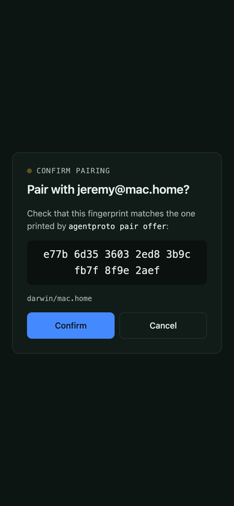
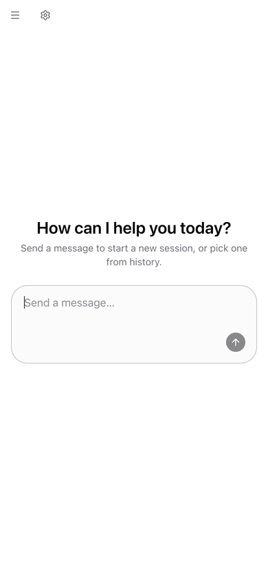
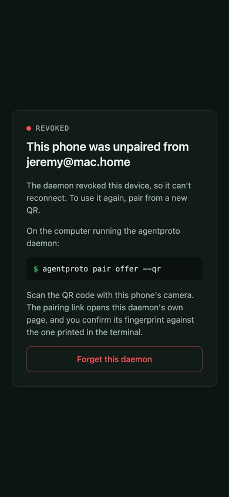
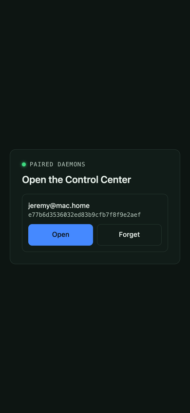
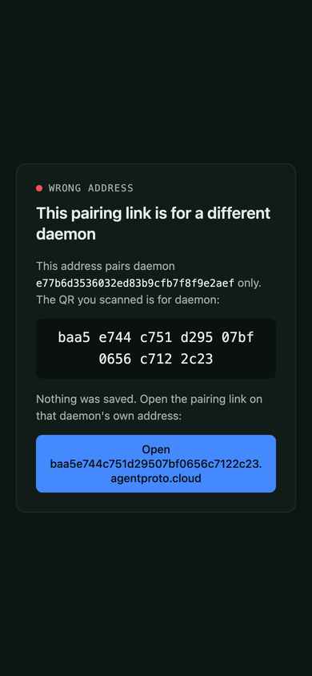

# Use agentproto from your phone

Pair your phone with a running `agentproto serve` daemon and get its
**Control Center** — the same session UI you'd open on the computer — as an
app-like page on your phone, live-streaming over an end-to-end encrypted
tunnel. No public tunnel, no port-forwarding, no account.

> [Download this guide as a PDF](./assets/phone-pairing/phone-pairing-guide.pdf).

## 1. What you get

`agentproto pair offer --qr` prints a QR code. Scan it, confirm a fingerprint,
and your phone opens the daemon's Control Center: the live session list,
chat, and everything else the daemon serves — proxied straight from the
daemon over the pairing, not copied or re-hosted anywhere.

It's safe to route through a broker you don't control because the broker
never sees your traffic: pairing is end-to-end encrypted (`pair/v2`), so the
rendezvous only ever relays **ciphertext**, and each daemon gets its own
browser origin, `<fingerprint>.agentproto.cloud`, so one daemon's pairing
can never read another's. See [concepts/pairing.md](../concepts/pairing.md)
for the full protocol and threat model.

## 2. Prerequisites

- **agentproto ≥ the release that ships pair/v2** on the computer running
  the daemon. (At the time of writing, pair/v2 and the per-daemon pair page
  are on `main` but not yet in a published release — check `agentproto
  --version` against the latest [CHANGELOG](https://github.com/agentproto/ts/blob/main/packages/cli/CHANGELOG.md)
  entry.) Don't rely on whether `--qr` is merely recognized — an older CLI
  can still accept the flag and print a link that 404s. Check the **printed
  link itself**: it should look like
  `https://<32-hex-chars>.agentproto.cloud/pair#…`, one origin per daemon.
  If it instead prints `https://cli.agentproto.sh/pair#…`, or the id/host
  label is only 16 hex characters, the daemon predates the per-daemon pair
  page — update agentproto on the computer, restart the daemon, and run
  `pair offer --qr` again.
- Any phone browser in a **secure context** (Safari or Chrome over HTTPS —
  which `agentproto.cloud` always is). Pairing needs service workers, so
  skip private/incognito tabs.

## 3. Pair in 3 steps

**On the computer**, with the daemon running:

```bash
agentproto pair offer --qr
```

This prints a QR for a phone link (`https://<fingerprint>.agentproto.cloud/pair#…`)
alongside the usual CLI offer, and shows the daemon's fingerprint in the
terminal.

**On the phone**, scan the QR with your camera. It opens the pair page,
which runs the handshake and shows you the daemon's fingerprint to confirm:



**Check that the fingerprint on the phone matches the one printed in the
terminal**, then tap **Confirm**. That's the human check that defeats a
swapped or malicious QR — the page refuses to skip it.

The Control Center opens automatically, proxied from the daemon over the
encrypted tunnel:



## 4. Using it

**Add it to your home screen** (Safari: Share → Add to Home Screen; Chrome:
⋮ → Add to Home screen) for a standalone, full-screen app rather than a
browser tab. Opening it later reconnects straight to your daemon.

If the page shows **"Connecting…"**, it's opening the tunnel through the
rendezvous — this is normal right after a reconnect. If it shows the daemon
as **unreachable**, either the daemon isn't running or the computer is
asleep; there's nothing to do on the phone — it retries on its own and
reconnects automatically once the daemon (and the computer) is back.

## 5. Unpair

**From the computer:**

```bash
agentproto pair ls               # see paired devices, by name/fingerprint
agentproto pair revoke <name>    # drop one — it can no longer reconnect
```

The phone doesn't just look offline — it gets told:



**From the phone:** open the pair page (`/pair`) and tap **Forget** next to
a daemon, or **Forget this daemon** on the revoked/outdated screen. This
only drops the credential stored on the phone; it doesn't touch the
daemon's side, so do both if you want it gone completely.

## 6. Several daemons

Each daemon has its **own address** — `<fingerprint>.agentproto.cloud` — and
its own separate credential, service worker, and storage on your phone.
Opening one daemon's paired address lists only that daemon:



If you scan daemon B's QR while already on daemon A's page (or an old tab
still points at A), you'll see **"wrong address"** — nothing is paired, and
the page links you to daemon B's own address instead:



## 7. Troubleshooting

- **"Unpaired" / "outdated pairing"** — the daemon no longer accepts this
  phone's pairing (revoked, or paired under a retired protocol version).
  Re-pair from a fresh QR: `agentproto pair offer --qr` on the computer,
  scan again.
- **A 404 on the pairing link** — check the link against
  `https://<32-hex-chars>.agentproto.cloud/pair#…` (see
  [Prerequisites](#2-prerequisites)). A `https://cli.agentproto.sh/pair#…`
  link, or a 16-hex-character id/host label, means the daemon predates the
  per-daemon pair page: update agentproto on the computer, restart the
  daemon, and get a fresh QR. Otherwise the link likely got
  mistyped/truncated when copied — get a fresh QR rather than retyping the
  URL by hand.
- **Offline forever, never reconnects** — check that the daemon process is
  actually running (`agentproto serve`) and that it can reach
  `pairing.rendezvous` (the hosted default is
  `wss://rdv.agentproto.sh/v1`) — a daemon with no network path to the
  broker can't be found.
- **Corporate/hotel network blocks it** — some networks block WebSocket
  (`wss://`) traffic outright. Try a phone hotspot, or
  [self-host the broker](#8-self-hosting-short) somewhere reachable from
  both sides.

See also: [concepts/pairing.md](../concepts/pairing.md) (protocol and
threat model), [verbs/pair.md](../verbs/pair.md) (full command reference),
and AIP-59 (the pairing spec) at
[agentproto.sh/docs/aip-59](https://agentproto.sh/docs/aip-59).

## 8. Self-hosting (short)

Both pieces the phone touches can be self-hosted:

- **The pair page** — point `pairing.pairPage` in `config.json` (or
  `--pair-page` per offer) at your own bundle (`packages/pair-page`), using
  a `{fp}` template in the hostname for one origin per daemon:
  `"https://{fp}.pair.example.com/pair"`.
- **The rendezvous broker** — run your own with `agentproto rendezvous
  serve` and set `pairing.rendezvous` to it instead of the hosted default.

See [concepts/pairing.md](../concepts/pairing.md#self-hosting-the-pair-page)
and [verbs/rendezvous.md](../verbs/rendezvous.md) for the details.
